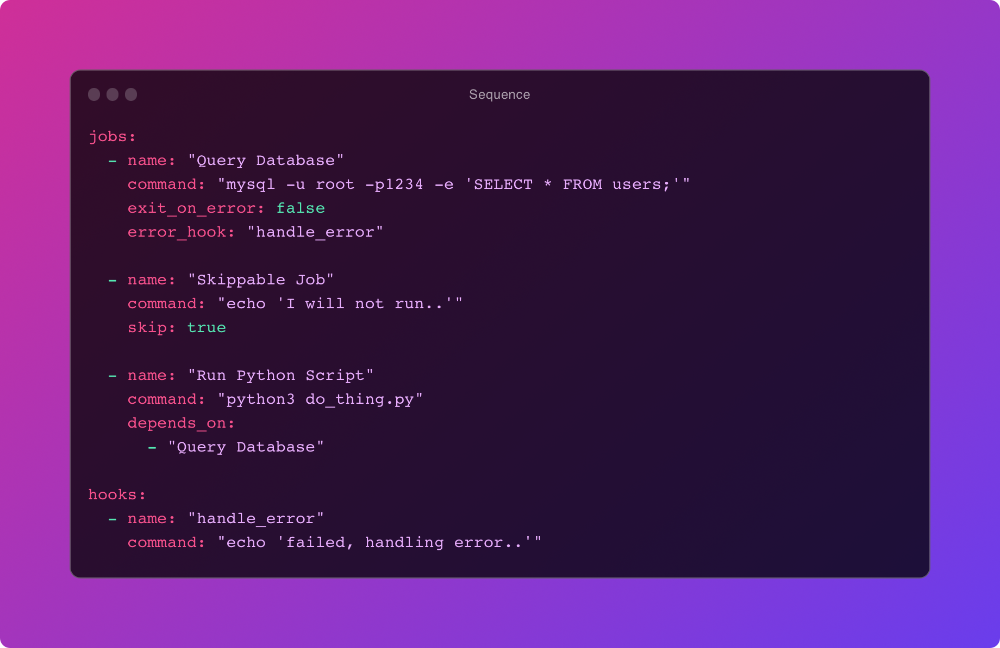

# Sequence

Sequence is a versatile automation framework designed to seamlessly integrate and orchestrate scripts and code snippets written in various languages. It serves as a powerful tool to connect disparate sequences of code, enabling the creation of sophisticated, cohesive automation workflows. If it can run in the terminal, you can sequence it!

## Quick Start
```shell
go install github.com/yourusername/your-repo-name/cmd/cli@latest
```
>[!NOTE]
>Prefer to build it? Check out the [Getting Started](https://github.com/arivictor/sequence/blob/main/README.md#getting-started) section.

## Features

- **Job Execution**: Execute a series of jobs defined in a structured YAML file.
- **Error Handling**: Specify error handlers for each job, providing robust control over error management.
- **Conditional Execution**: Define dependencies among jobs, ensuring that certain jobs run only after their dependencies have executed successfully.
- **Job Skipping**: Flexibly skip certain jobs without removing them from the configuration, allowing for dynamic adjustments of the job sequence.
- **Exit Control**: Control the continuation or termination of the sequence when a job fails, based on the `exit_on_error` attribute.



## Getting Started

### Prerequisites

- Go (version 1.15 or later)

### Installation

1. Clone the repository:

    ```bash
    git clone https://github.com/arivictor/sequence.git
    ```

2. Navigate to the repository directory:

    ```bash
    cd sequence
    ```

3. Build the application:

    ```bash
    go build -o sequence ./cmd/cli
    ```

### Configuration Schema

Define your jobs and their properties in a YAML file. Below is a template of how the configuration should look:

```yaml
jobs:
  - name: "Say Hello"
    command: "echo 'Hello World!' && exit 1"
    exit_on_error: false # quits the process on error
    success_hook: "some handler"
    error_hook: "some handler"
    skip: false

  - name: "Run JavaScript"
    command: "node hello_world.js"
    depends_on: ["Job 1"] # Won't run, depends on the first job

hooks:
  - name: "some handler"
    command: "echo 'handling success..'"
```

> [!NOTE]  
> See [example.yaml](./cmd/cli/example.yaml) for a more verbose example..


### Running Sequence

To execute the jobs as per your configuration file (e.g., `config.yaml`), use the following command:

```bash
./sequence --workflow workflow.yaml
```

> [!NOTE]  
> 1. Filepaths defined in jobs are executed relative from where the command is executed.
> 2. Workflows will move to the next job even if the job fails, you must explicity set `exit_on_error` to `true` if you wish the workflow to fail hard.

## Contributing

Contributions are what make the open source community such an amazing place to learn, inspire, and create. Any contributions you make are **greatly appreciated**.

1. Fork the Project
2. Create your Feature Branch (`git checkout -b feature/AmazingFeature`)
3. Commit your Changes (`git commit -m 'Add some AmazingFeature'`)
4. Push to the Branch (`git push origin feature/AmazingFeature`)
5. Open a Pull Request

## License

Distributed under the MIT License. See `LICENSE` for more information.
